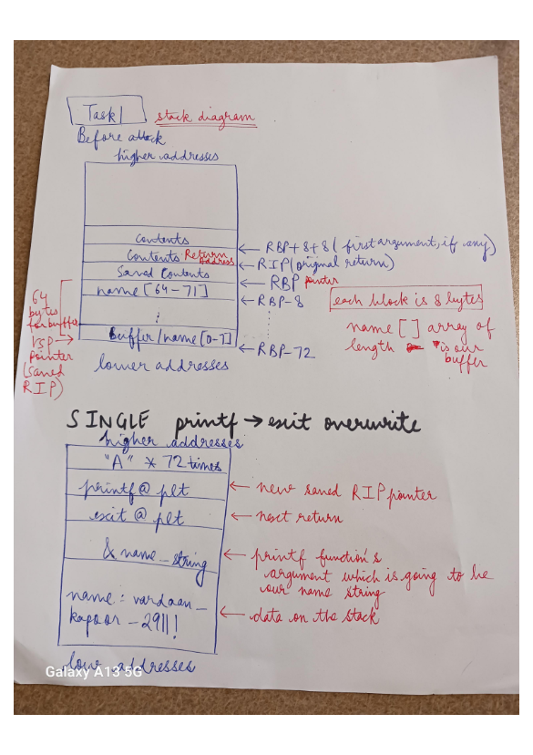
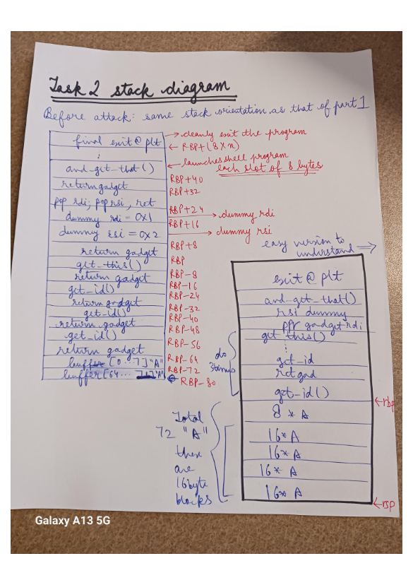
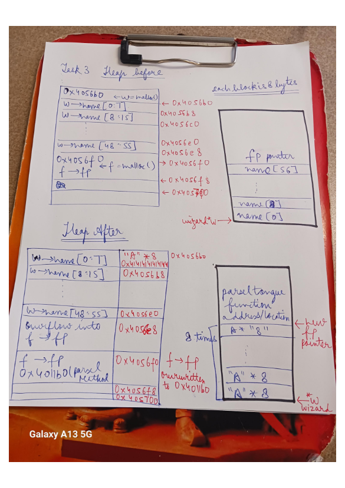

# CS 642 Project Buffer Overflow - Report
- **Name:vardaan kapoor**
- **NetID:9084212951 vkapoor5**

## Tasks Outline

For each task, outline below your approach to solve them; giving the commands
you ran, the analysis of the output of these commands, and the reasoning behind
each step. You should complete these explanations in this report by comments in
your code.

### Task 1

This task gives us a stack address leak from where we can start working. This is concept of ASLR(just like libc attack where you should know starting address of standard C library). We have to use both PLT(procedure linkage table) and Gadgets. PLT can be obtained from objdump command and gadgets from ROPgadget command.

1) when the unix binary executable file for task12 is run, then by its leaked address, we try to make our payload file. We have to decide how many "A" we have to put so as to overwrite the return address. This we can get through gdb and finding rsi and rpi.

Our aim thus is to determine offset fromm start of input buffer to return address.We know that name[] array has max length 60 which is already predefined.

Name[] array is our target buffer here as that only will be used so we have to start trackign address from here. So run gdb ./task12 and then put a breakpoint at get_lightsaber method whose first line instantiates the buffer we are aiming at. Now try to find saved rip(instruction pointer) which is different from "saved registers" rip-this rip points to next isntruction while the saved rip tells us where the function get_lightsaber will fgo to or return to after it is done executing. So we focus on this "Saved rip" pointer and not the other rip pointer. We also look at rbp pointer's location(all of this is still done using command info frame in gdb). We get that saved rip is x4014dd. 

what we need to calculate offset now that we are at get_lightsaber() method's first line: we need $rbp+8 hex value(convert to long) and also &name variable's memory location(again in hex so convert to long). We subtract both of them to get value 72-this becomes our hardcoded value for offset

example: (gdb) print (long)0x7fffffffe048-(long)0x7fffffffe000

we get  72 iin this computation 

in this first step, we also use scanf method to get leaked adrdess from the user and do exception handling if not correct hex address is entered.

2) initialize a payload collector which will be put to the file we are writing as our task 1 payload(this collector will be submitted to become the contents of this payload file)- currently we initialize it with our offset which we got =72. Also initialize our name string and end it with null terminating character which is"\0". Also make sure there is no space in the name as given in template in the starter code for task 1 file. Now also initialize an ROP chaian which can collect and chain different gadgets(which are in itself some chunks of usable codes which can chain into each other).

3) now declare actual gadgets which will be used and chained. 

we need the following-

rsi, rdi, printf(from plt), exit(from plt), starting gadget( from the gadgets we get from ROPgadget output on our unix executable binary file task12)

rsi has offset 20 from the leaked stack address and so has rdi

starting gadget whose motivartion we get from the video on ROP is at 0x401608

command : ROPgadget --binary task12 | grep ": pop rdi ; pop rsi ; ret"

0x0000000000401608 : pop rdi ; pop rsi ; ret

exit(from plt) and printf(from plt) can be obtained from objdump -rdl task12 command when we look at disassembly of the plt section in specific-get hex addresses from here

command :  objdump -Rdl task12 | grep "printf" 

objdump -Rdl task12 | grep "exit"

4) now actually start doing the attack and creatig the payload which we will write to the payload file in the end

we put 72 "A" to the payload collector we created using memset function. At this stage we have reached the return address so now can start ovrflowing

5) now we prepare parameters for printf so first chain normal rop gadget with pop rdi, pop rsi, ret 

next chain rdi and then chain rsi

6) now we prepare stack to invoke printf function so that our name as its argument can be printed. We first chain printf gadget(from plt) and then for cleanly exiting, we chain exit(from plt)

till onw we have put 14 words( 9 words for 72 bytes, 8*9=72, and 10th word is ropgadget, 11th is rdi, 12th is rsi,13th is printf, 14th is exit ).

7) now put our actual name string which we initialized before as argument to printf function(this is going to be 15th word so bytewise it is at 8*15th location  offset form the start of payload collector). Now payload collector array contains 15*8 bytes

8) now write this payload to the task1-payload file -we are writing 15*8 bytes. Use write_to_file() function which is given to us. Currently i am making my name streth to 26 chraacters+one null terminating character, so 27 in total. Thus i am adding 8*14+27 as length.
### Task 2

concept we have to add: aligning the stack so use a different gadget which is like no op gadget and only is used for aligning the stack(40126f gadget described later).

We have to first print get lightsaber id 4 times and then print hello there and then print general message and thenopen up a schell, which is done in tandem with the general message.

we place in order, 3 copies of get_id at successive return‐slots on the stack:

we need 6 gadgets- first we need starting gadget, then exit, then gadget for getting id(a new random id which can be obtained from the function), then return gadget, and then finally gadgets for get_this and get_that functions so they can be called at end of the rop chain

note: we don't need printf gadget as we needed in task 1 because now whatever we need to print can be printed by some other function which in itself contains the printf function(this function here is get_id function)

1) our offset to start is still 72 as code of task 1 and task 2 are same so ASLR offsets will be same

2) get exit gadget(same as task 1-objdump command)

get return gadget(here is x126f)

0x000000000040126f : nop ; ret

then get normal gadget for rdi, rsi, return(same as task 1)

get gadget for get_id(this is address of first line of the function which we get from objdump command only)

get gadgets for get_this and get_that(again first lines of both functions using objdump command)

 objdump -d task12 | grep get_id-get x401331

  objdump -d task12 | grep get_this-x401590

  objdump -d task12 | grep and_get_that-get x4015b4

  ROPgadget --binary task12 | grep ": nop ; ret" 

3) now start doing the attack by chaining the gadgets

initialize a variable for rop chain and create a buffer(like task 1) with length 72 so we can fill "A" iin that to overflow the buffer

we initialize the rop chain to start from buffer/collector+72(our fixed offset)

fill buffer with 72 "A"

4) now build the rop chain

 add noop return gadget to align stack > add get_id gadget > add noop return gadget > add get_id gadget > add noop return gadget > add get_id gadget > add noop return gadget > ad get_this gadget > add noop return gadget > add proper gadget > add x01 for rdi > add x02 for rsi > add no op gadget > add get_that gadget to open shell > add no op gadget > add exit gadget to exit cleanly

 these are 16 words(steps) and 9 words for the 72 bytes- in total we have 9+16=25 words

 now write this whole collector/buffer to the task2-payload file with length=8*25=200 bytes

where to find and check if our payload is perfectly aligned-go to last instruction of get_lightsaber which is 0x4013dc and then run command x/40gx $rsp to see contents of the stack there-you will see 9 words(each word containing 8 "A") followed by the other 16 words we have added

 sample output:

 Breakpoint 2, 0x00000000004013dc in get_lightsaber () at cs642-victim-task12.c:40
40      in cs642-victim-task12.c
(gdb) x/40gx $rsp
0x7fffffffe000: 0x4141414141414141      0x4141414141414141
0x7fffffffe010: 0x4141414141414141      0x4141414141414141
0x7fffffffe020: 0x4141414141414141      0x4141414141414141
0x7fffffffe030: 0x4141414141414141      0x4141414141414141
0x7fffffffe040: 0x4141414141414141      0x000000000040126f
0x7fffffffe050: 0x0000000000401331      0x000000000040126f
0x7fffffffe060: 0x0000000000401331      0x000000000040126f
0x7fffffffe070: 0x0000000000401331      0x000000000040126f
0x7fffffffe080: 0x0000000000401590      0x000000000040126f
0x7fffffffe090: 0x0000000000401608      0x0000000000000001
0x7fffffffe0a0: 0x0000000000000002      0x000000000040126f
0x7fffffffe0b0: 0x00000000004015b4      0x000000000040126f
0x7fffffffe0c0: 0x00000000004011f4      0x0000000000401300
0x7fffffffe0d0: 0x00000001ffffe1b0      0x00007fffffffe1c8
0x7fffffffe0e0: 0x0000000000000000      0x850940d281d2d8ee
0x7fffffffe0f0: 0x00007fffffffe1c8      0x00000000004013de
0x7fffffffe100: 0x0000000000403e00      0x00007ffff7ffd040
0x7fffffffe110: 0x7af6bf2d4050d8ee      0x7af6af659b58d8ee
0x7fffffffe120: 0x00007fff00000000      0x0000000000000000
0x7fffffffe130: 0x0000000000000000      0x0000000000000000

### Task 3

Replace this text with your answer.
Aim: get access to fp struct and for that we have to write after or overflow or exceed the struct before that which is wizard struct. Thus our buffer is wizard struct and we have to overwrite and overflow it.

we have to get offset or distance between the start of wizard struct and start of fp pointer-this is the number of characters("A") we have to put in our overflow to reach fp pointer.

1) get address or starting location of first line of open the chamber method

command to be run- objdump -d task3 | grep openTheChamber

received: 0000000000401196 <openTheChamber>:

the wizard struct contains name buffer(array) so we have to find out the relative position/offset of name array wrt fp pointer. For doing this, we have to do some overflowing with "A" .

2) get offset of name array wrt fp. We set breakpoint at main and when we get to it, we go to malloc instantiation for wizard struct variable W, press next command and find address for this variable in the heap.

output is 0x4056b0- this is start of wizard struct and also start of name buffer(array) as it is the sole element of the wizard struct W

now to get address of fp pointer variable F we have to press next commmand. We get 0x4056f0

now this offset difefrence will give us number of "A" we have to put-we get 0x4056f0-0x4056b0=0x40=64 (integer value conversion from hexadecimal=1000000 in bianry)

3) now we have the return address so prepare something to which this pointer can point to next which is my own code of my want-so we want to point to parseltongue() method. Find this method's address again using objdump command

objdump -d task3 | grep parseltongue

we get 00000000004011b0 <parseltongue>:

Thus essentially we fill 64 "A" unlike task 1 and 2 which filled 72 "A" to reach the return pointer/address and then relocate to somewhere else-we append address 0x4011b0 to our developing payload.

Total words in payload=8(64/8)+1 word for return pointer=9 words in total so 64+8 bytes in total to be written=72 bytes in the task3-payload file for our attack

## Questions

## Q1: Draw the function’s stack frame from task 1 and task 2 to demonstrate the overflow

## Q2: Specify the gadgets used and their purpose for task 2

Replace this text with your answer.

we need 6 gadgets- first we need starting gadget, then exit, then gadget for getting id(a new random id which can be obtained from the function), then return gadget, and then finally gadgets for get_this and get_that functions so they can be called at end of the rop chain

the nop return gadget is just used for stack alignment and is put after every other gadget we are using to align the stack. This gadget doesn't do anything else-it only aligns the stack and moves instruction pointer next past it

the pop pop return gadget is used before we run get_this method after we have aligned stack and have also run the get_id method in total 3 times extra to print different lightsaber IDs. Thus this gadget is used to handle inputs which we are creating and passing to the other methods we are going to call like get_this and get_that which print a statement and also open a shell program.

## Q3: Draw a diagram for the heap for task 3 before and after the attack

## Q4: What is the best way to ensure safe string processing in the C language?

In C, the single biggest root-cause of stack overflows (and thus ROP-style hijacks) is unbounded string operations. The most effective way to eliminate that class of bug is to treat every string copy or concatenation as a potential overflow. We should always use length bounded functions like instead of using  strcpy(dest, src) we use 	strncpy(dest, src, sizeof dest) which is length bounded. Similarly, we should use a different version of fscanf function which is fscanf(get exact number of bytes you want to read instead of reading till you find null terminating character).We should validate and sanitize all inputs before working on them like check lengths before any copying or concatenation operations.

## Q5: Identify a defense that would prevent the attacks in tasks 1-3. Precisely describe how that defense would prevent the attack.

  For parts 1 and 2, we can just use the safe version of fscanf and other length bounded function restrictions as I mentioned in question 4. For part 3, we have to stop somehow reaching the method parsel tongue so that we are never able to execute it. If length given is greater than 55(which is the defined size for name array or our target buffer), then we give error. Also if we use strncpy instead of normal strcpy then we would have to specify the number of bytes we actually want to copy and this can be checked as now we are getting an explicit number from the programmer(again the concept of length bounded function alternative for strcpy normal function).
